<meta name="viewport" content="width=device-width, initial-scale=1">
<meta name="color-scheme" content="light dark">

<a href="../Projects.html">&larr; Back to Projects</a>

# Sumo Robot Project

### Design

#### Design Constraints
- 10"x 10" x 5" size constraint
- Cost under $200
- Total weight under 5lbs
- 3A max stall current for all motors
- 14V maximum battery
- Only using ATMega328P

#### Design Methodology
- The plan was to maximise grip on the drive wheels. The stall current limitation likely meant most motors would similar torque specs, hence weight and grip would drive which robot would resist pushing.
- To maximise grip we optimized two parameters, the normal force and the friction coefficient between the wheels and the ground.
#### Ground Effect Downforce
- The robot was built to weigh close to 5lbs. We add a fan to suck air from underneath the robot to generate downforce. The idea was to increase the normal force on the robot without exceeding the weight limit of 5lbs since the robot was weighed with the fan turned off.
- Due to the power limitation on the fan motor, the fan did not generate a measurable amount of downforce. It was a cool concept to implement regardless of its effectiveness

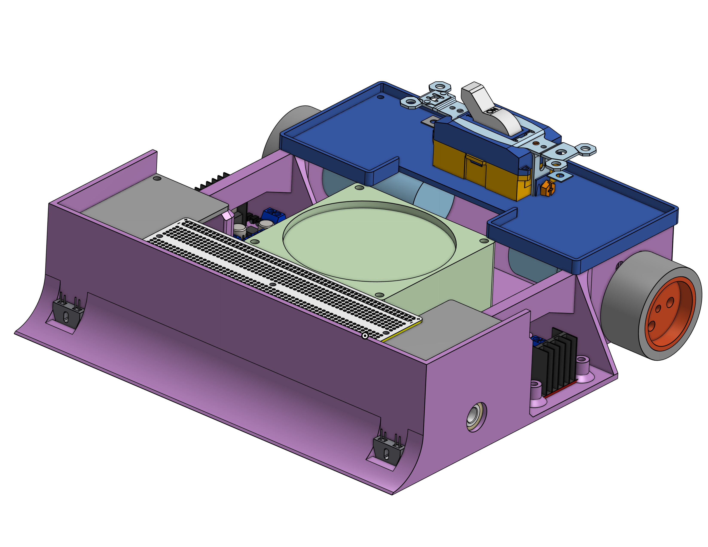
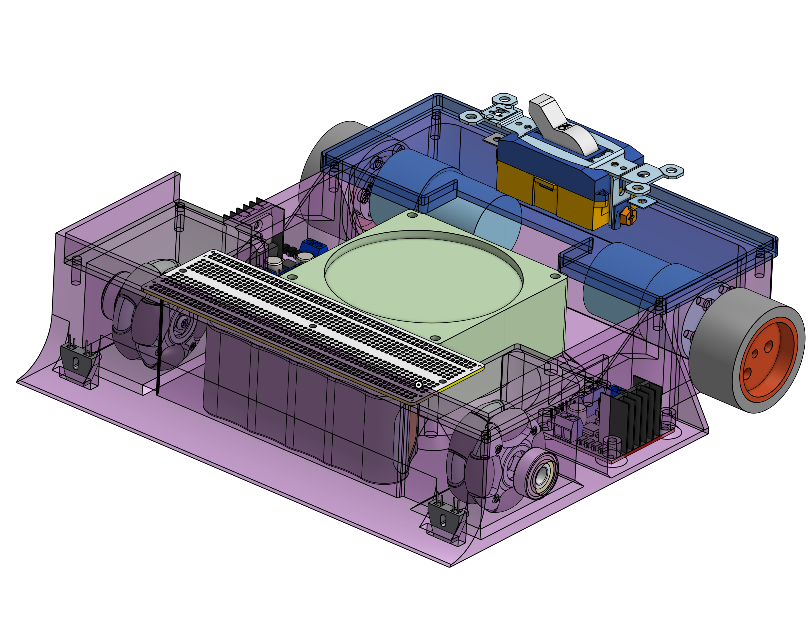

### Test prints

<table style="border-collapse: collapse; border: none;">
  <tr>
    <td style="border: none;">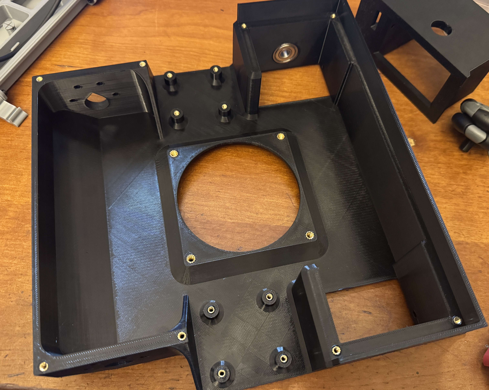</td>
    <td style="border: none;">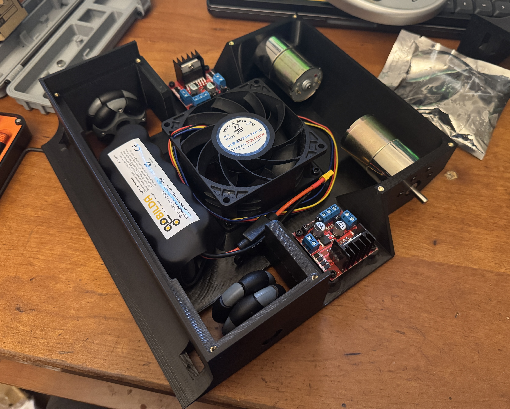</td>
  </tr>
</table>

### 3D Printed Chassis

### Overmolded Silicone Wheels

- To optimize the friction coefficient between the wheels and the ground, I made custom 3D printed wheels with silicone cast tires. I used a soft durometer silicone and designed a wheel rim and mold to cast the silicone around the wheel rim.
- Additionally I designed the chassis so that the rear wheels maintained contact with the ground when the front was lifted (like with a wedge during a match). This can be seen in action in the videos below.
- Initially I designed the battery to be housed in the front to make it harder to lift the front and to balance the weight distribution with the two motors in the back. 
- However, in practice the motors had too much torque and the wheels were slipping. Moving the battery to the back significantly increased the grip on the driving wheels. This made the front end easier to lift, but the trade off was worth it since the driving wheels had much more grip and maintained contact with the ground when the front was lifted.
  

<table style="border-collapse: collapse; border: none;">
  <tr>
    <td style="border: none;">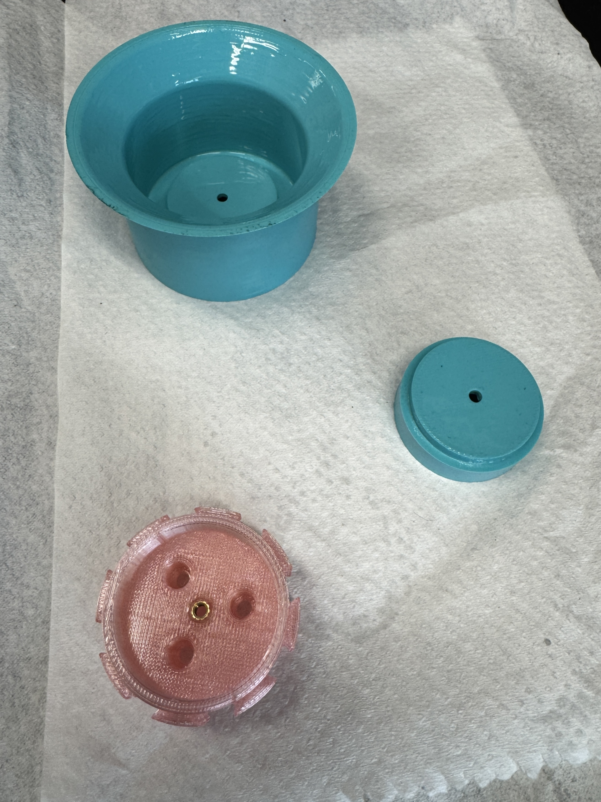</td>
    <td style="border: none;">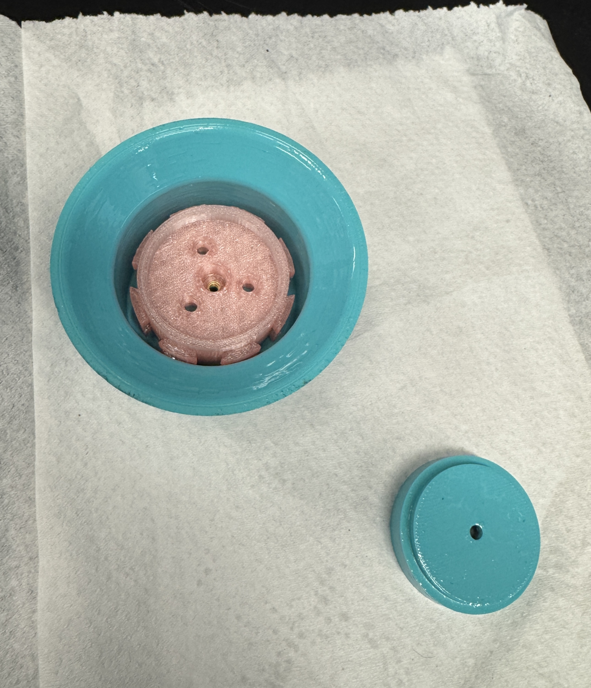</td>
  </tr>
  <tr>
    <td style="border: none;">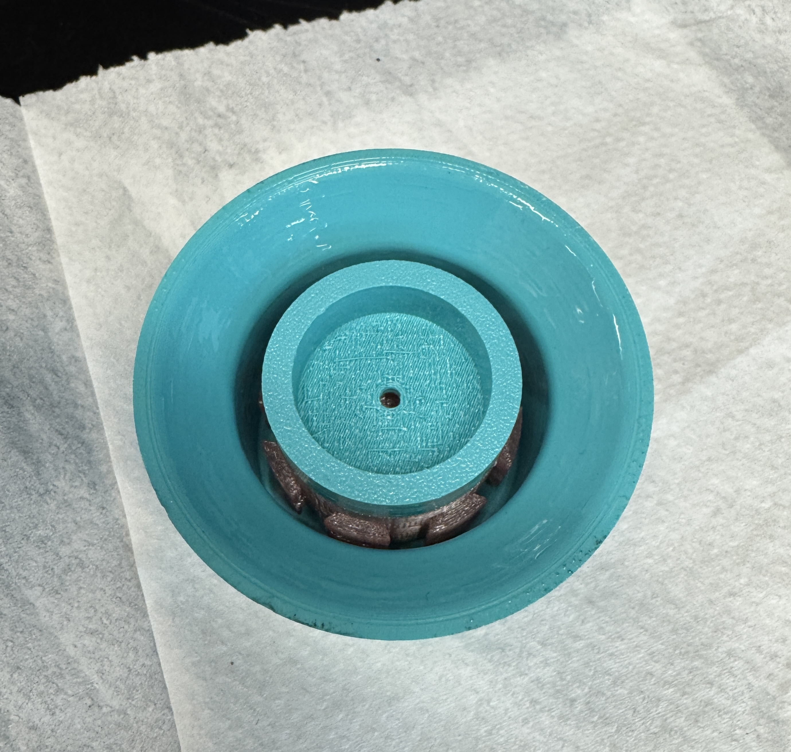</td>
    <td style="border: none;">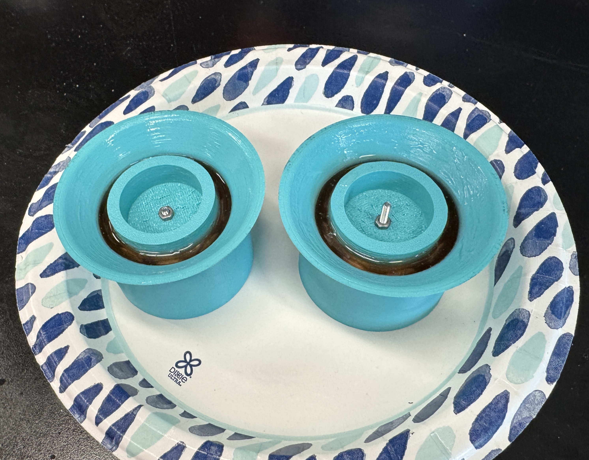</td>
  </tr>
</table>

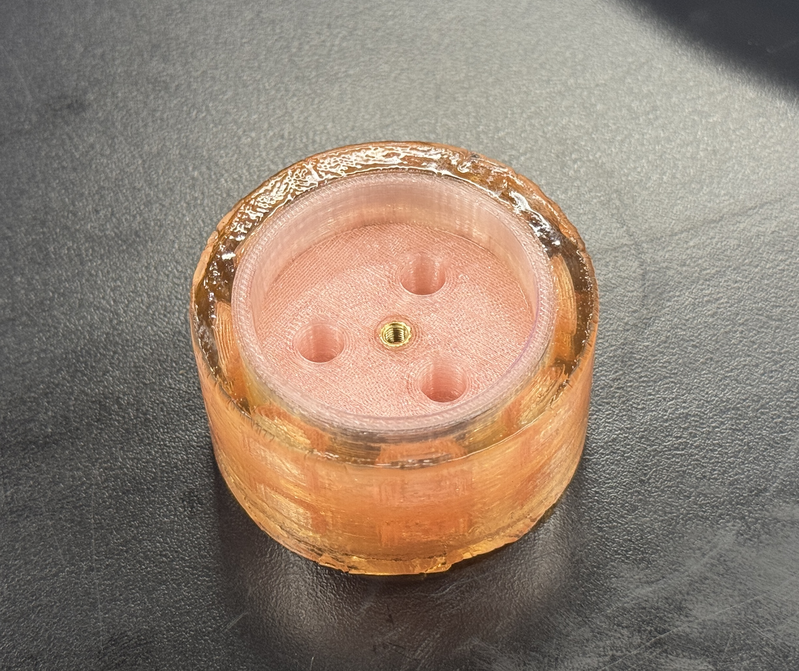

### Final Robot
<table style="border-collapse: collapse; border: none;">
  <tr>
    <td style="border: none;">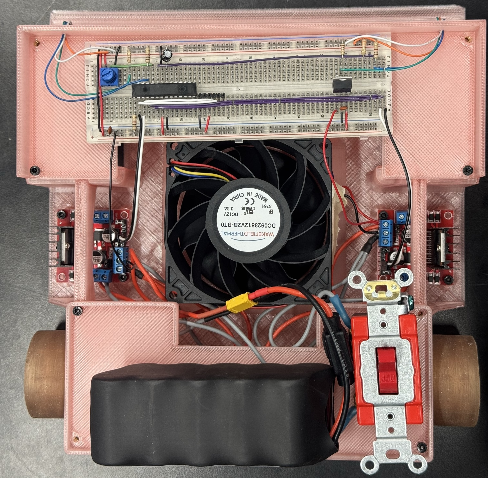</td>
    <td style="border: none;">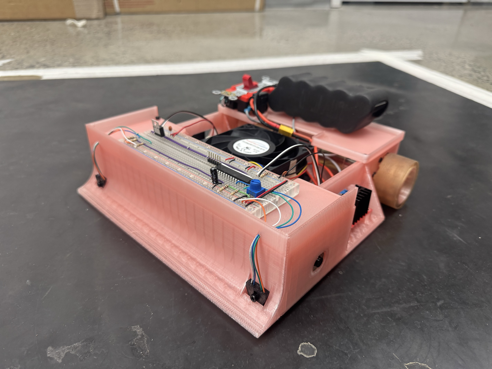</td>
  </tr>
 <tr>
 <tr>
    <td colspan="2" style="border: none; text-align: center;">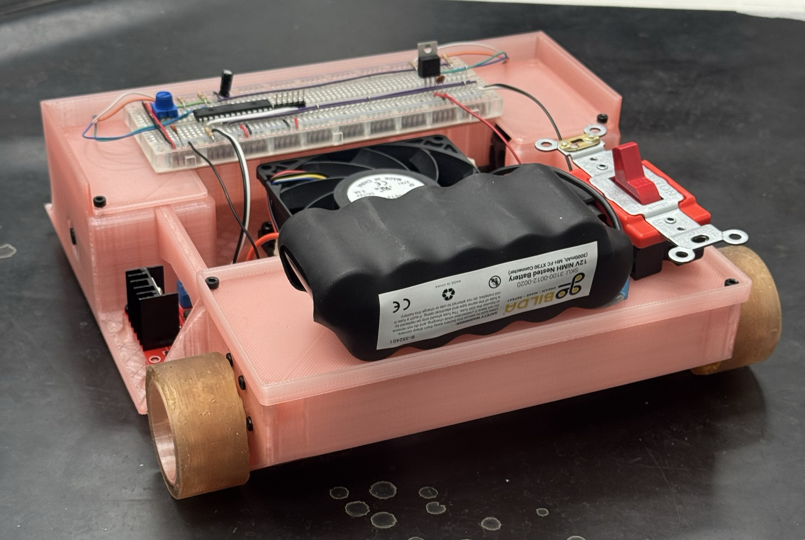</td>
  </tr>
  </tr>
</table>

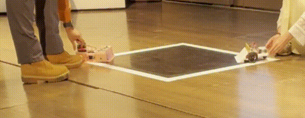
